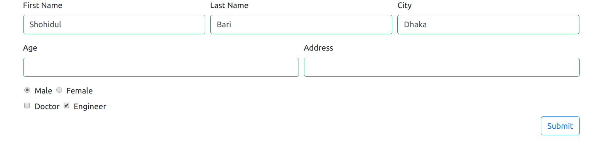

# Introduction

**react-bootstrap-formkit** is a **package** for **react** form creating with **bootstrap 4** and It has easy form data handling functionality. In this package, Bootstrap form grid is used for making grid form. There are also facility to use your own bootstrap form class. If you don't provide your own bootstrap class, default style will be applied. This package is now supporting almost every HTML Form Fields. Happy Coding!

  

# Documentation

If you need a simple bootstrap 4 form, You are in right place. This package will create your desired form with bootstarp 4 grid and provide functionality to handle that form. Lets start!

  

## Supported Form Fields

Almost every HTML form fields are supporting now. Here is a list of major supported fields and their data type.

| Field Name | Data Type | Default Value |

|--|--|--|

|text |string |Empty String ("")|

|radio|string|Field Value|

|checkbox |array |Field Value|

|file | JS File Object | undefined|

|date | JS Date Object or String | undefined |

|password | String | Empty String ("") |

|number | Number | undefined |

|color | String | undefined |

  

You can use any type of form field. It will render dynamically.

  

## Installation:

```bash

npm i react-bootstrap-formkit

```

## Environment Set Up

Make sure that your project is using bootstrap 4 with CDN (***It is recommended)*** or bootstrap 4 standard classes are accessible in your project. Thats it.


## Props:

  

### All props are required.

  

### fields:

#### Attributes

- type : required

- name: required

- label: optional

- key: optional but recommended otherwise react will complain.

- id: optional but recommended.

- className: optional but provide if you want your own style

- required: true/false. by default it is false.

  

This is an array which contains grid information. this package works with bootstrap 4 grid.

  

#### Example:

  

- Every Field must have type and name attribute otherwise package will complain. you don't have to specify value here unless you define a radio type or checkbox type. radio and checkbox type should have a value.

  

```js
let formGrid =
	[
			[
				{type: "text", label: "First Name", key: "1", id: "firstname", name: "firstname", required: true},
				{type: "text", label: "Last Name", key: "2", id: "lastname", name: "lastname"},
				{type: "text", label: "City", key: "3", id: "city", name: "city"},
			],
			[
				{type: "text", label: "Age", key: "4", id: "age", name: "age"},
				{type: "text", label: "Address", key: "5", id: "address", name: "address"}
			],
			[
				{type: "radio", label: "Male", key: "6", id: "gender", name: "gender", value: "male"},
				{type: "radio", label: "Female", key: "7", id: "gender", name: "gender", value: "female"}
			],
			[
				{type: "checkbox", label: "Doctor", key: "8", id: "profession", name: "profession", value: "doctor"},
				{type: "checkbox", label: "Engineer", key: "9", id: "profession", name: "profession", value: "engineer"}
			]
	]
```

### submitButton:

For developers freedom, here is an option of designing submit button. This is an object and should have two key-pair value, **name** and **className** (bootstrap 4 className)

  

```js
let submitBtnInfo = {
	name: "Submit",
	className: "btn btn-outline-primary btn-md float-right"
}
```

### onSubmit:

This functionality also developed for developers freedom. This is an handler function and should be defined as asynchronous. This function receive data from form submit and provide developer for further use. You can send data asynchronously from here.

```js
const handleSubmit = async data => {
	console.log("On Submit Method Called");
	console.log(data);
};
```

  

### initialValue:

This is a state management system. This package provide user a state and it will update dynamically when there will any change in form. To define initialValue, Be careful about your field name. This is an object with key-value pair. key is the **name** attribute of fields. Every name of your **fields Props** should be entry here as key-value pair. value is your choice. But if you provide a field without entry here, Package will complain.

```js

let initialState = {
	firstname : "Shohidul",
	lastname : "Bari",
	city : "Dhaka",
	age : undefined,
	address: undefined,
	gender: "male",
	profession: ["engineer"]
}
```

### Now use it in your component:

```js
import FormKit from "react-bootstrap-formkit";
function App() {

return (
	<div className="App">
		<div className="container">
			<FormKit
				fields={formGrid}
				submitButton = {submitBtnInfo}
				onSubmit = {handleSubmit}
				initialValue = {initialState}
			/>
		</div>
	</div>
);
}

```
  
## Sample Preview


# Happy Coding!